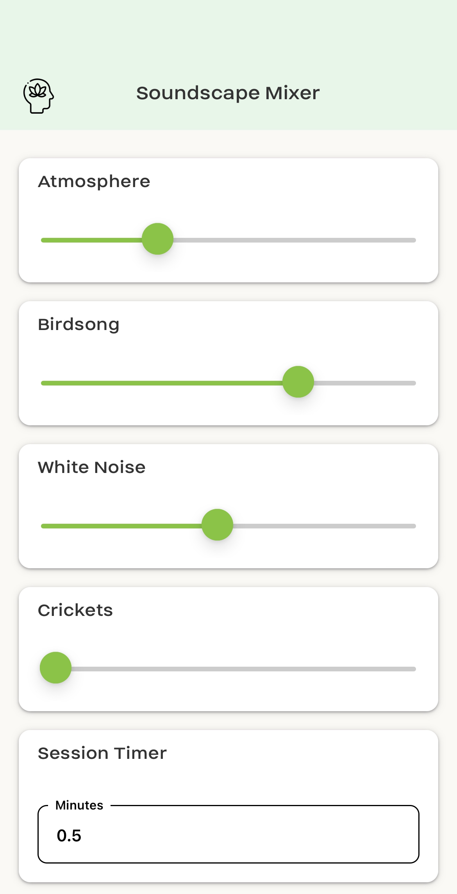
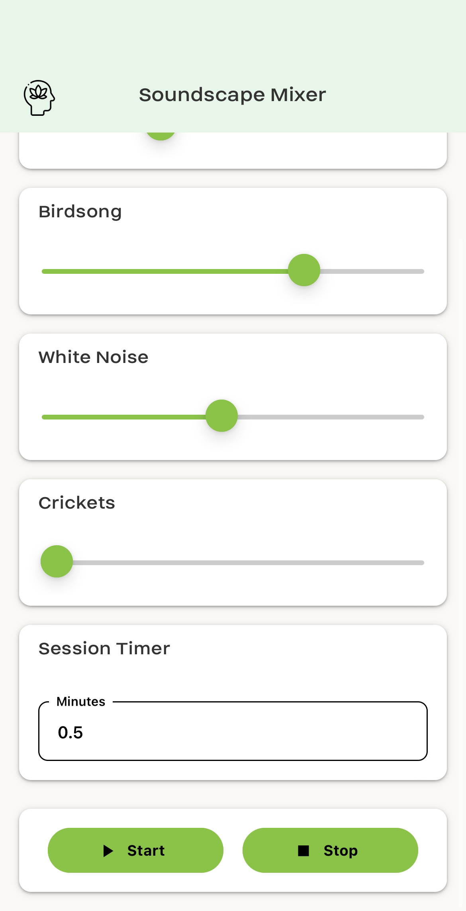

# Soundscape Mixer

Soundscape Mixer is a mobile app built with React Native and Expo that lets you mix ambient sounds—such as atmospheric noise, birdsong, white noise, and crickets—to create a personalized soundscape for relaxation, meditation, or focus. The app features an intuitive interface with individual volume sliders, a session timer, and a light, nature-inspired design. I created Soundscape Mixer to help address my own struggles with falling asleep, giving me the freedom to experiment with different sound combinations for as long as I need. Plus, the app makes it easy to add your own sounds, allowing you to fully customize your experience to suit your unique needs.
## Features

- **Ambient Sound Mixing:**  
  Mix multiple ambient sounds by adjusting individual volume sliders.

- **Customisability:**  
  Easily add new sounds with only one line of code in index.tsx.
  
- **Session Timer:**  
  Set a timer (in minutes) to automatically stop playback after a desired duration. Once the timer is done, it plays a friendly alarm sound to remind you. 

- **Modern UI:**  
  A light, nature-inspired design with a custom font ("Helmet") and natural green accents.

- **Cross-Platform:**  
  Developed with React Native and Expo, ensuring compatibility with both iOS and Android devices.

## Tools and Technologies Used

- **React Native & Expo:**  
  Provides a fast and efficient framework for building cross-platform mobile apps.

- **expo-av:**  
  Enables audio playback functionality, including looping and volume control for ambient sounds.

- **react-native-paper:**  
  Implements Material Design components to build a clean and modern UI.

- **expo-font:**  
  Loads and applies custom fonts within the app.

- **@react-native-community/slider:**  
  Offers a smooth slider component for controlling sound volumes.

## Installation

1. **Clone the Repository:**

   ```bash
   git clone https://github.com/ShafeiW/SoundscapeMixer.git
   cd soundscape-mixer
   ```
2. **Install Dependencies:**   

   ```bash
   npm install
   ```

3. **Install Expo CLI (if not already installed):** 

   ```bash
   npm install -g expo-cli
   ```

## Running the Project 

1. **Start the Expo Server:**

   ```bash
   npx expo start -c
   ```

2. **Run on a Device or Emulator:**
iOS: Use the Expo Go app or run on an iOS simulator.
Android: Use the Expo Go app or run on an Android emulator.

## Screenshots 


